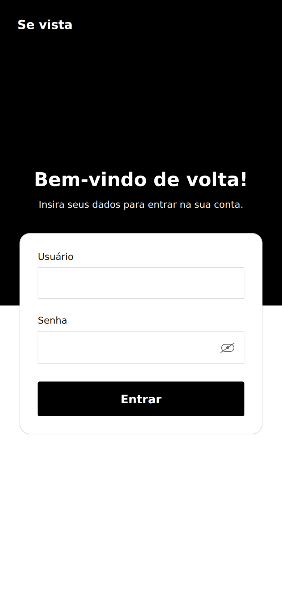
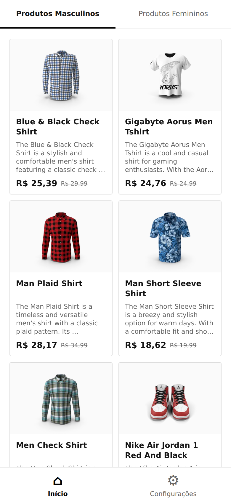
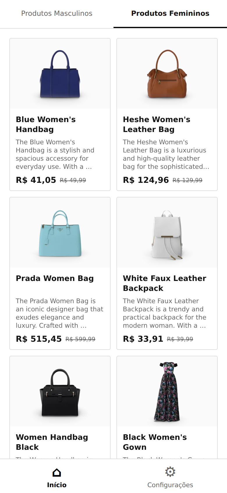
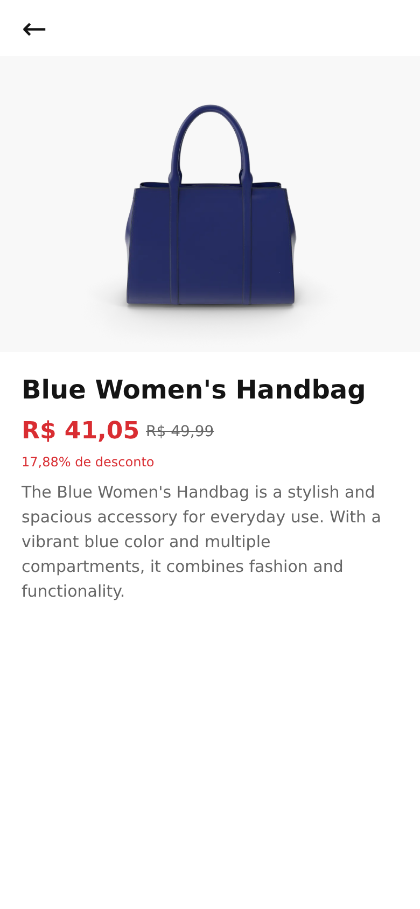
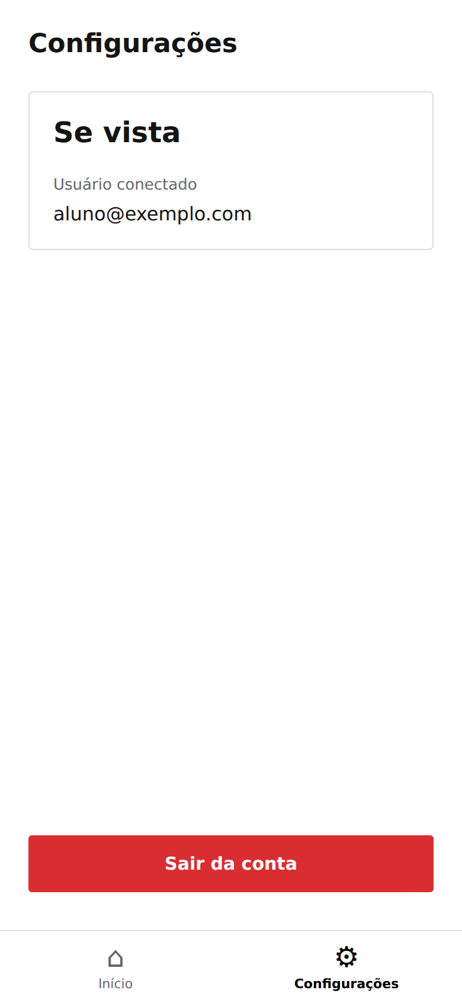
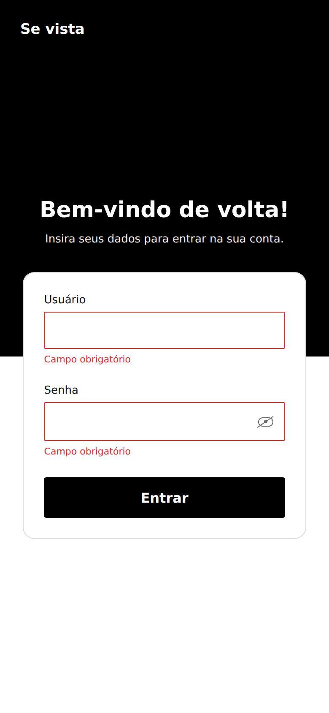

# Catálogo Interativo Mobile com Listagem de Produtos por Categoria

**Aluno:** Mikael Douglas  
**Disciplina:** Mobile Development

**Nome da loja:** Se vista  
**Identidade visual:** preto, branco e cinza.

Aplicativo desenvolvido com React Native e Expo para consultar produtos da API DummyJSON. O usuário faz um login simulado, navega pelas categorias masculina e feminina e abre os detalhes dos produtos.

## Tecnologias utilizadas

- React Native e Expo
- Axios
- Redux Toolkit e React Redux
- Expo Router para navegação entre telas e abas

Os demais pacotes do projeto dão suporte à execução e à navegação no Expo.

## Como executar

É necessário ter Node.js 24 LTS, npm e conexão com a internet.

Na pasta do projeto, execute:

```bash
npm ci
npx expo start
```

Abra o projeto no Expo Go compatível com o SDK 57. O celular e o computador devem estar conectados à mesma rede.

Para executar no navegador:

```bash
npm run web
```

**Dados para testar o login:**

- Usuário (e-mail): `aluno@exemplo.com`
- Senha: `123456`

O login é simulado. Qualquer e-mail válido e senha com pelo menos seis caracteres permitem entrar. O e-mail fica salvo apenas em memória pelo Redux Toolkit; a senha não é armazenada. Ao fechar ou recarregar o app, é necessário entrar novamente.

## Funcionalidades

### Login

O campo Usuário recebe um e-mail. Campos vazios recebem a mensagem “Campo obrigatório”. Quando ambos estão preenchidos, mas o e-mail ou o tamanho da senha são inválidos, o formulário mostra “Usuário ou senha inválidos”. A senha exige pelo menos seis caracteres. O ícone no campo permite mostrar e ocultar a senha. Como o login é simulado, não existe consulta de credenciais a um servidor.

### Listagem de produtos

As abas Produtos Masculinos e Produtos Femininos ficam no topo. Cada aba reúne todas as subcategorias exigidas. Os cards mostram imagem, nome, resumo da descrição e preço. A barra inferior permite alternar entre Início e Configurações.

| Aba | Categorias da API |
| --- | --- |
| Masculino | `mens-shirts`, `mens-shoes`, `mens-watches` |
| Feminino | `womens-bags`, `womens-dresses`, `womens-jewellery`, `womens-shoes`, `womens-watches` |

O Axios consulta o endpoint `https://dummyjson.com/products/category/{categoria}`. O parâmetro `limit=0` permite buscar todos os produtos da categoria. Durante a consulta, aparece um indicador de carregamento. Em caso de erro, o usuário pode tentar novamente.

### Detalhes do produto

Ao selecionar um produto, o aplicativo passa seu ID para a próxima tela e consulta `https://dummyjson.com/products/{id}`. A tela apresenta nome, descrição, preço, percentual de desconto e imagem. O botão Voltar retorna à listagem.

Os nomes e as descrições são exibidos no idioma retornado pela API. Neste exercício, `price` é tratado como preço-base e `discountPercentage` é aplicado uma vez na apresentação: `price × (1 - discountPercentage / 100)`. O resultado é arredondado para duas casas, e o valor-base aparece riscado. Os valores são apresentados em reais por convenção didática, para acompanhar o modelo visual; não há conversão cambial ou cotação.

### Logout

Em Configurações, o botão vermelho Sair da conta limpa os dados do usuário e retorna ao login. As telas do catálogo ficam indisponíveis enquanto não houver uma nova sessão.

## Organização do código

| Pasta | Responsabilidade |
| --- | --- |
| `app` | Rotas, abas e navegação por ID |
| `src/screens` | Telas de login, listagem, detalhes e configurações |
| `src/components` | Componentes compartilhados entre as telas |
| `src/services` | Configuração do Axios e consultas à API |
| `src/store` | Estado do login com Redux Toolkit |
| `src/hooks` | Controle de carregamento, erros e cancelamento das consultas |
| `src/constants` | Categorias e seus rótulos |
| `src/styles` | Cores utilizadas nas telas |
| `src/utils` | Validação dos campos e formatação dos valores |

Os estilos de cada tela ou componente ficam em um `StyleSheet`, separados da renderização. As funções de consulta ficam nos serviços, sem misturar as chamadas HTTP com os componentes visuais.

## Modelo visual

A disposição das telas foi adaptada a partir das capturas do Figma fornecidas: formulário sobreposto ao cabeçalho, categorias no topo, grade com descrições, navegação inferior e detalhes com preço destacado. O tema preto e o nome Se vista são personalizações em relação ao azul da referência. O botão de adição não foi implementado, pois o enunciado proíbe adicionar, editar e excluir produtos.

## Capturas das telas

As imagens abaixo foram capturadas na execução web, em uma janela com dimensões de celular.

| Login | Produtos masculinos |
| --- | --- |
|  |  |

| Produtos femininos | Detalhes do produto |
| --- | --- |
|  |  |

| Configurações e logout | Campos obrigatórios |
| --- | --- |
|  |  |

[Visualizar o estado de falha no login](docs/prints/07-login-invalido.png).

## Documentação

- [Reflexão contextual](docs/reflexao-contextual.pdf)
- [Telas e funcionalidades](docs/funcionalidades.pdf)

## Verificação

Foram verificados no navegador os estados de login, as oito categorias, a navegação superior e inferior, os detalhes por ID, o cálculo do desconto, a recuperação de erro e o logout. As verificações de interface reproduziram respostas capturadas da API DummyJSON. Os bundles de Android e iOS foram gerados. Esta versão do layout ainda deve ser conferida em aparelho físico.

## Referências

- [Documentação da DummyJSON](https://dummyjson.com/docs/products)
- [Documentação do Axios](https://axios-http.com/docs/intro)
- [Documentação do Redux Toolkit](https://redux-toolkit.js.org/tutorials/quick-start)
- [Documentação do Expo Router](https://docs.expo.dev/router/introduction/)
